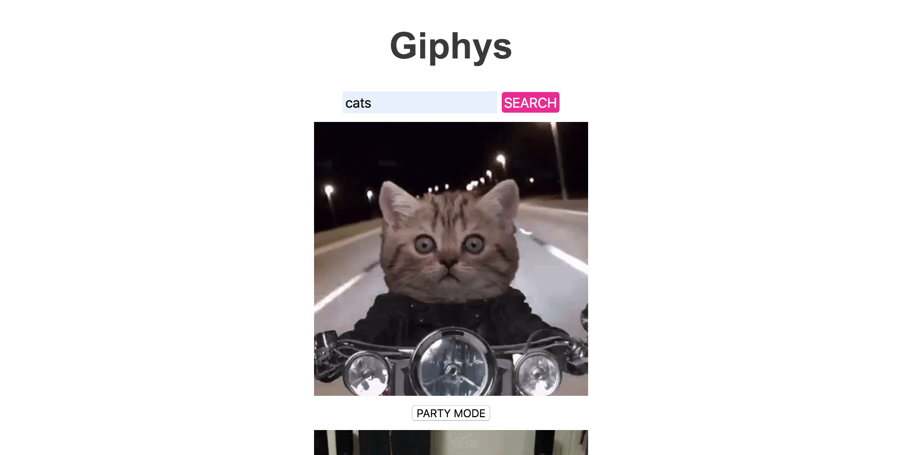

# Giphy

Giphy is a fun little app that let's you search for a topic and returns all gifs using that keyword.

screenshot.png

### To use:

Click on the link below:
 https://pablang.github.io/giphys/

 - Search for a keyword in the input field and click "Search"

 - Click "PARTY MODE" and see what happens!

 - Scroll is finite, but you can still click for more

### Features

- Infinite scroll
- "Party Mode" button for those who like to watch gifs dance

### Approach

- Written in Javascript, HTML, CSS
- I created a basic HTML form for the input field
- On submit the form takes the search term and invokes a function to call the giphy api using AJAX and loads them by appending each result to a new DOM
- I limited the fetch to 10 and added an eventlistener to the container of the results so to be able to add the infinite scroll
- After five reloads I enabled a load more button instead
- With each gif result loaded a party button was also appended
- when clicked it adds a CSS class that animates the gif to translate in a circular motion

### Tech Used
- Javascript
- Jquery/Ajax

### API Shoutout
Thank you to GIPHY Developers for letting me use your api

https://developers.giphy.com/

